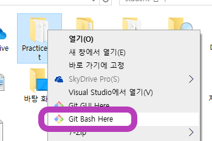
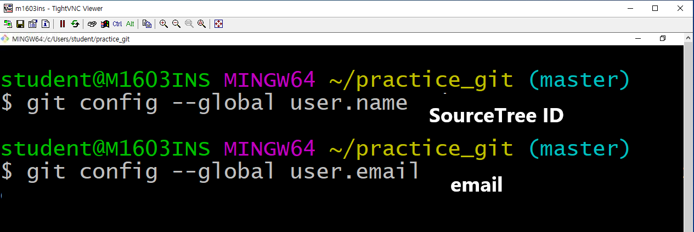

# Git 기초

## 개념

### SCM 이란?

Source Code Manager의 약자

코드의 버전을 관리를 위해 존재

## 관련 프로그램

### Git

로컬저장소 관리

https://git-scm.com/download/win

#### 시작 설정

 Git에서 저장소를 만들때 가장 먼저 해야할 일은 바로 <.gitignore> 파일 설정이다. 필요없는 data나 공유하면 안되는 중요 파일을 예외 처리 하기 위한 설정이다. 

#### .gitignore 설정 참고

http://gitignore.io/ 에서 사용하는 엔진이나 언어를 기입하면 .gitignore 파일에 추가해야할 설정이 출력된다.

### GitHub

클라우드 저장소 관리

https://github.com/

### Sourcetree

Git 관리 GUI

https://www.sourcetreeapp.com/

#### 로컬저장소 설정

##### 참고. 생성이 안될 때

저장소로 사용할 폴더 우클릭

아래의 명령어 사용

#### Git/Github 연동

##### Sourcetree 연동 준비

##### Github 설정 및 url 주소 확인

##### Sourcetree에서 Git, Github 연동

### Typora

README.md 파일(markdown 파일) Editor

https://www.typora.io/#windows

#### 환경설정

이미지 저장을 위한 환경설정

