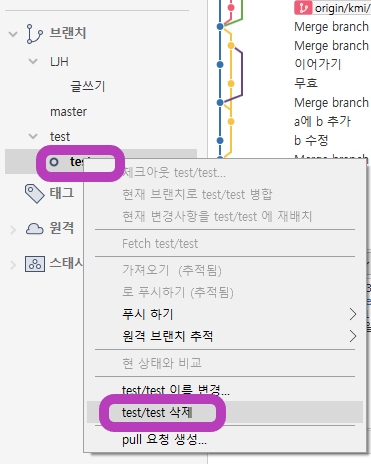

# Git 기초

## 개념

### SCM 이란?

Source Code Manager의 약자

코드의 버전을 관리를 위해 존재

## 관련 프로그램

### Git

로컬저장소 관리

https://git-scm.com/download/win

#### 시작 설정

 Git에서 저장소를 만들때 가장 먼저 해야할 일은 바로 <.gitignore> 파일 설정이다. 필요없는 data나 공유하면 안되는 중요 파일을 예외 처리 하기 위한 설정이다. 

#### .gitignore 설정 참고

http://gitignore.io/ 에서 사용하는 엔진이나 언어를 기입하면 .gitignore 파일에 추가해야할 설정이 출력된다.

### GitHub

클라우드 저장소 관리

https://github.com/

### Sourcetree

Git 관리 GUI

https://www.sourcetreeapp.com/

#### 로컬저장소 설정

#### Git/Github 연동

##### Sourcetree 연동 준비

##### Github 설정 및 url 주소 확인

##### Sourcetree에서 Git, Github 연동

##### 참고 - commit이 안될 때

저장소로 사용할 폴더 우클릭

아래의 명령어 사용

#### PUSH / PULL을 이용한 동기화

##### PUSH

 Sourcetree에서 로컬에 저장된 내용을 온라인 저장소에 upload

##### PULL

 Sourcetree에서 온라인 저장소에 저장된 내용 로컬로 download

#### CLONE

Github의 온라인 저장소url 위치를 확인

Sourcetree에서 Github에서 받아온 url를 받아와서 저장

#### Team Project

Github에서 해당 프로젝트에 Setting -> Collaboration 에서 Github ID를 추가. (추가시  e-mail로 초대 메세지가 전달 됨)

초대 받은 사용자들은 CLONE 과정을 통해 data 공유

#### BRANCH

##### 생성

이어올 branch에 체크아웃 상태에서 브랜치 생성

###### 참고 - 체크아웃

Sourcetree에서 위와 같이 포커싱 되어 있는 상태

##### 삭제

삭제할 branch가 아닌 다른 branch에 체크아웃을 하고 삭제

#### MERGE - Local

기준이 될 브랜치에 체크아웃 상태에서 병합할 브랜치 우클릭 -> 현재 브랜치로 병합

병합 후 위와 같이 그래프가 이어진 것을 확인

##### 참고 - master branch

master branch는 주로 배포 가능한 버전을 관리. 개발은 다른 branch에서 개발해서 병합하는게 안전

#### Recovery

##### 초기화

돌아갈 commit을 우클릭 -> 초기화

HARD - 시점으로 파일들이 완전히 돌아감

MIXED - commit 목록에 안 올리고 commit하기 전 단계로 돌아감

SOFT - commit 목록에 올리고 commit하기 전 단계로 돌아감

 **Local 에서의 복구는 비교적 간단한 편이지만 온라인으로 업로드 후에 복구는 history가 꼬일 수 있음(왠만하면 Online push 후에 복구를 통한 작업을 하지 말자)**

###### 참고 - commit 전에 리셋하는 방법

history에서 바로 전에 commit한 곳에 checkout(청소)

#### MERGE - Online

Sourcetree에서 commit한 branch만 push

Github에서 push 정보 확인

세부 내용 작성

Merge pull request ?? - 뭐하는건지 알아보자

이 상태에서 Sourcetree의 pull 실행시 위오 같이 아직 merge가 안되 있는걸 확인 가능

confirm을 하면

위와 같이 merge 상태가 확인 되고

Sourcetree에서 pull 하면 위와 같이 표기

최종적으로 위와 같이 출력된다면 online 상에서 merge가 완료

##### 참고 - 

 visual code에서는 merge에서 충돌나는 경우. 충돌난 파일이 보라색으로 보임

 branch 잔가지도 바로 master에 통합 가능

 origin 은 그냥 default로 설정된 이름. 바꿔도 상관없음

### Typora

README.md 파일(markdown 파일) Editor

https://www.typora.io/#windows

#### 환경설정

이미지 저장을 위한 환경설정

