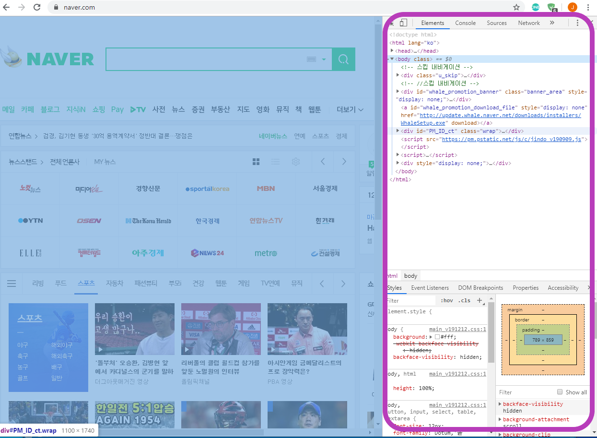
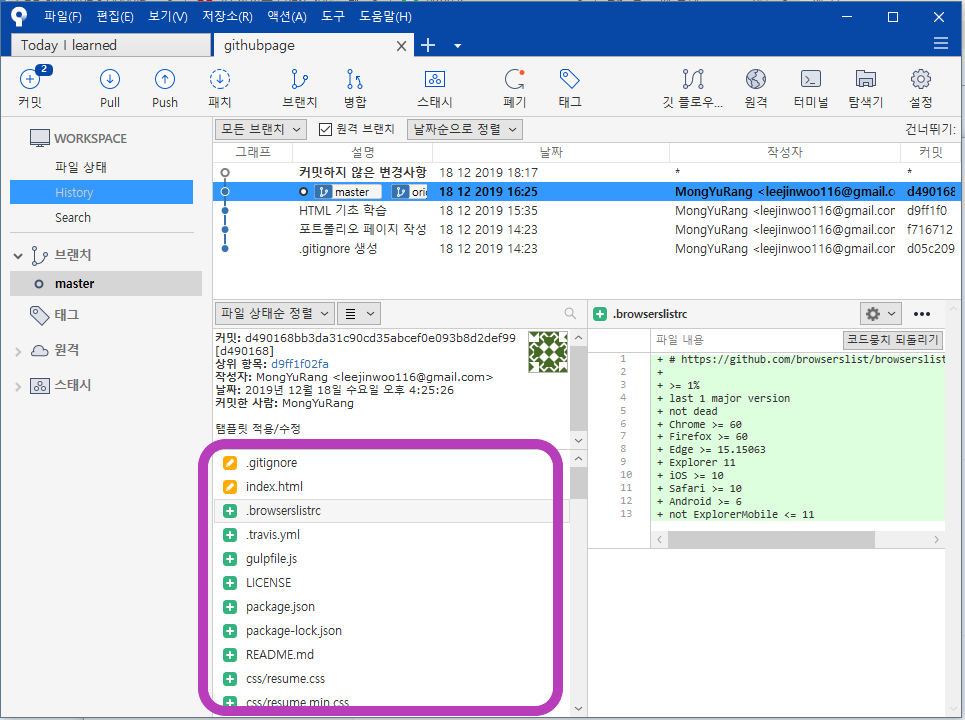

# HTML 기초

웹브라우저에서 'F12' 를 누르면 개발자 모드창이 출력되고, 해당 페이지의 코드를 볼 수 있다.

## 구성 요소

### text

 화면에 출력하는 문자열

### tag

 text에 class, id 등을 설정해 구분

 속성/기능 부여

#### 복합 tag

 ex> <title></title>, 

 

#### 단독 tag

 ex> 

####  속성 필요 tag

 ex> <a href="https://www.naver.com"> 네이버 </a>

#### 속성 옵션 tag

 ex> 

####  무속성 tag

 ex> <em> </em><em>    </em>

####  참고

 tag는 대소문자 구별이 없음

### script

 내부 동작을 짜는 코드

## 참고사이트

http://flukeout.github.io/ - css 기초 코드 테스트

https://getbootstrap.com/ - 참고 탬플릿 

## Github에 웹페이지 만들기

Github repo에 웹페이지를 생성할 수 있는 파일들을 PULL하면 웹에서 접근 가능

 참고 사이트에서 다운 받은 탬플릿을 그대로 로컬저장소에 올리고 

ajantang.github.io <- 온라인 저장소에 PULL 한 결과

https://ajantang.github.io/

로 접속시 index.html 파일이 샐행된다

