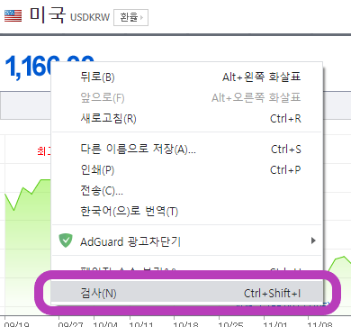
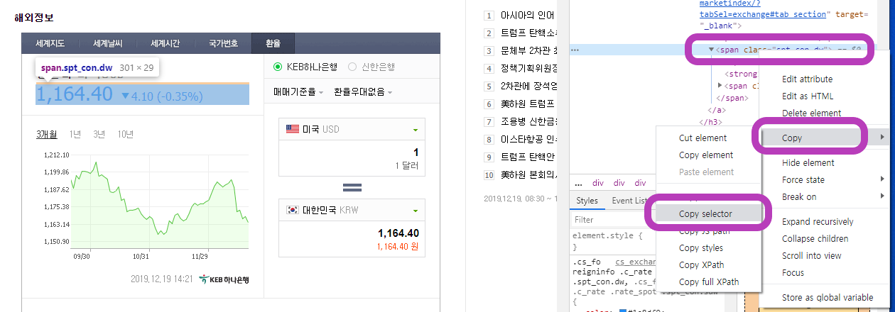
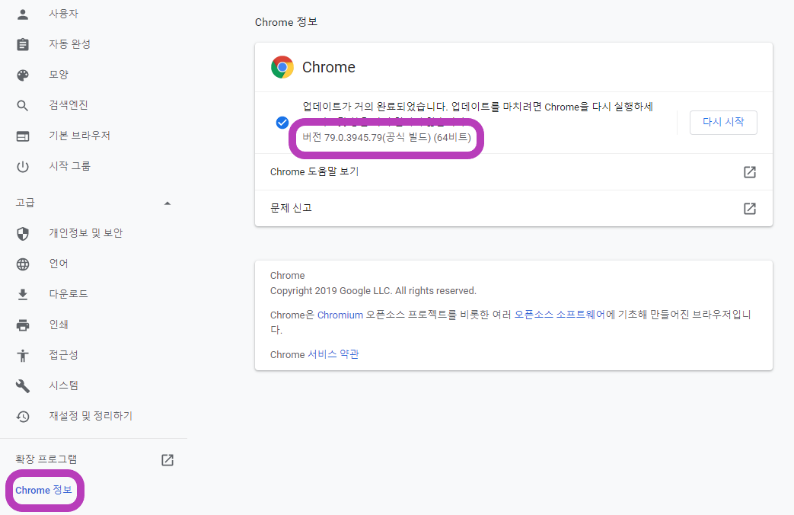
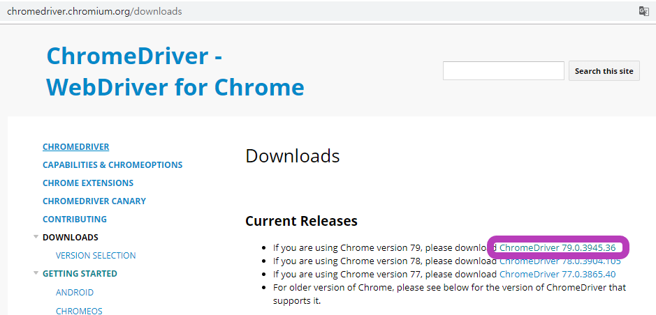

# Python 기초

## Python 설치

https://www.python.org/ - python 설치 시 옵션 체크해야 되는 부분이 있음


## 실습 1 - 저장, while문

```python
tree = '나무'
deco = '장식'

# while문
while len(tree) < 20:
    tree = tree + deco
    
christmas_tree = tree
print(christmas_tree)
```

위의 코드를 실행하면 '나무장식장식장식...(생략)' 의 결과가 나옴


## 실습 2 - for문

```python
# print 함수를 활용해 '인사'를 10번 출력

hi = '인사'
k = 0

#while i<10:
 #   i=i+1
  #  print(hi)

for k in range(0,10):
    print(hi)
```

주석 처리한 while문과 결과 동일


## 실습 3 - 랜덤, 문자열 생성 및 설정

~~~python
# 명단에서 이름을 뽑나서 영어 소개와 한글 소개 작성

import random

name = ['홍','희동','둘리']
eng_name = {
    '홍':'hong',
    '희동':'dong',
    '둘리':'dul'
}

지목된사람 = random.choice(name)
지목된영어이름 = eng_name[지목된사람]

intro = '저는 '+지목된사람+'입니다. '+'My name is '+지목된영어이름
intro2 = '저는 {}입니다. My name is {}'.format(지목된사람, 지목된영어이름)
intro3 = f'저는 {지목된사람}입니다. My name is {지목된영어이름}'

print(intro)
print(intro2)
print(intro3)
~~~

'저는 홍입니다. My Name is hong' 이라고 출력됨(랜덤이라 결과값은 3 종류가 있음)


## 실습 4 - 자료형 dictionary

~~~python
# 자료형 Dictionary

import random

menu = ['새마을식당','초원삽겹살','멀캠20층','편의점','홍콩반점']

phone_book = {
    '새마을식당':'010-1234-1234',
    '초원삽겹살':'010-2345-2345',
    '멀캠20층':'010-3242-2314',
    '홍콩반점':'010-4235-2364',
    '순남시래기':'이전'
}

lunch = random.choice(menu)
print(lunch)
print(phone_book[lunch])
# 랜덤으로 고른 식당 출력
# 해당 식당 전화 번호 출력
~~~

menu의 데이터 하나와 그에 맞는 전화번호가 출력


## 실습 5 - 랜덤(로또 번호 뽑기), 정렬

```python
# 로또 번호 출력

import random

lotto = range(1,46)

number = random.sample(lotto, 6)

number.sort() # 정렬 결과 저장
sorted(number) # 정렬 결과 미저장
print(number)
```

정렬된 랜덤 로또 번호 출력


## 실습 6 - request, bs4

```python
# 네이버 증시에 대신 접속해서 현재 코스피를 가져오는 프로그램
import requests
import bs4

# 이 주소로 요청을 보내면 html 파일이 도착할 것
html = requests.get('https://finance.naver.com/sise/sise_index.nhn?code=KOSPI')

# html text를 내가 보기 좋게 접근할 구 있도록 변경
soup = bs4.BeautifulSoup(html.text, 'html.parser')

# css selector로 내가 원하는 태그를 가쟈오겠다
kospi = soup.select_one('#now_value') 

print(kospi)
```

libary를 추가해서 웹사이트의 정보 확인. 출력.

### 참고 - tag 정보 확인

F12로 개발자 모드 ON



원하는 웹사이트 영역에서 우클릭 -> 검사



개발자 창에서 해당 HTML 코드 영역이 표시됨 -> 우클릭 -> copy -> Copy selector 로 정보 추출


## 실습 7 - 배열, 웹사이트 데이터 추출

```python
import requests
import bs4

html = requests.get('https://www.naver.com/')
soup = bs4.BeautifulSoup(html.text,'html.parser')

tests = soup.select('span.ah_k') #tag가 span 이면서 ah_k는 class 인 데이터

# tests배열을 하나부터 열까지 다 돌면서 test에 문자열 삽입 for문
#for test in tests:   
#   print(test)

# 배열 [0:n] -> 배열의 0번째 인덱스부터 n-1번째 인덱스들의 요소를 가져와 배열 생성
real_keywords = tests[0:20]
#print(real_keywords)

# 참고
#numbers = [i for i in range(0,101)]
#print(numbers)

real2_keywords = [keyword.text for keyword in real_keywords]
#print(real2_keywords)

problem = sorted(real2_keywords)

print('아래의 보기 중 1위를 고르시오')
print(problem)
answer = input('당신이 입력한 답 :')

if answer == real2_keywords[0]:
    print('정답')
else :
    print('오답')
```

네이버 급상승 겁색어에서 데이터를 가져와 배열에 저장. 출력된 리스트 중 1위 검색어 찾기 프로그램


## 실습 8 - 웹사이트에 데이터 출력 및 동작

```python
from selenium import webdriver # c++의 using namespace와 동일
from selenium.webdriver.common.keys import Keys

#import bs4
#soup = bs4.BeautifulSoup()
#from bs4 import BeautifulSoup()
#soup = BeautifulSoup() # 주석처리한 위의 두 줄과 아래 두줄이 같음

path = './chromedriver.exe'
driver = webdriver.Chrome(path)
driver.get('https://www.google.com/')
search_input = driver.find_element_by_css_selector('#tsf > div:nth-child(2) > div.A8SBwf > div.RNNXgb > div > div.a4bIc > input')
search_input.send_keys('우워웡워워')
search_input.send_keys(Keys.RETURN)
```

구글의 검색어 영역 tag 정보를 가져와 데이터를 전송. Keys.RETURN은 좀 더 알아보자

### 참고 - 사전 준비(selenium)



크롬을 통해 사용할 예정이라 크롬 버전 우선 확인



크롬 버전에 맞는 구글 드라이버 다운 -> 실습 코드 폴더에 저장 -> python에서 'pip install selenium' 명령어 실행


``` c++

```

